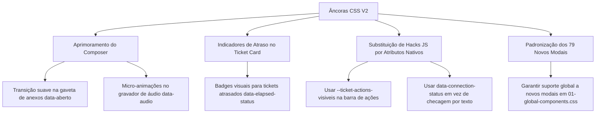

# Relatório Comparativo: Âncoras CSS v1 vs v2 (NextyChat / WSW)

Este documento apresenta uma análise aprofundada comparando o catálogo inicial de âncoras (`Ancoras-CSS.md`) com o catálogo atualizado (`Ancoras-CSS_V2.md`), identificando novas perspectivas, refinamentos arquiteturais e oportunidades de melhoria para o ecossistema do **NextyChat Redesign**.

---

## 1. Visão Geral dos Números

| Categoria | V1 (`Ancoras-CSS.md`) | V2 (`Ancoras-CSS_V2.md`) | Variação |
| :--- | :---: | :---: | :---: |
| **Páginas Mapeadas** | 89 | **97** | 🟢 **+8 telas** |
| **Modais com Âncora** | 95 | **174** | 🟢 **+79 modais (+83%)** |
| **Âncoras Específicas** | 186 | **260** | 🟢 **+74 âncoras (+40%)** |
| **Atributos de Estado (`data-*`)** | 44 | **140** | 🚀 **+96 atributos (+218%)** |
| **Propriedades Controladas via CSS** | 0 | **1 (`--ticket-actions-visiveis`)** | 🌟 **Novo Recurso** |

---

## 2. As Grandes Mudanças de Perspectiva

### 2.1. Controle Reativo via CSS Custom Properties (CSS manda no JS)
* **V1**: O frontend media os botões via JavaScript interno e empurrava o restante para o menu overflow `⋯`. Se a medição falhasse ou o CSS aplicasse margens/paddings diferentes, o layout quebrava ou exigia JS customizado (como fizemos em `02-ticket-actions.js`).
* **V2**: Introdução da propriedade `--ticket-actions-visiveis` em `.custom-css-ticket-actions`.
  ```css
  /* O CSS define diretamente quantas ações cabem na barra */
  .custom-css-ticket-actions {
    --ticket-actions-visiveis: 3;
  }
  ```
  Isso elimina a corrida de renderização entre a medição automática do React e os estilos injetados.

---

### 2.2. Cartão do Ticket & Lista de Atendimentos (`04-tickets-list.css`)
A V2 adicionou atributos de estado vitais que antes exigiam leitura de texto, cálculo de datas ou classes dinâmicas do MUI:

1. **Status de Atraso e Tempo de Espera**:
   * `data-elapsed-status="fresh|warning|late"`: Permite criar indicadores visuais em degradê de urgência (verde para recente <30m, amarelo para alerta <60m, vermelho para atrasado >60m) com CSS puro.
   * `data-elapsed-late="true|false"`: Seletor booleano simplificado para estilizar tickets estourados sem parsing de strings.
2. **Favoritos nativos**:
   * `data-favorite="true|false"`: Permite destacar cards favoritados na lista sem depender de checagem do ícone svg interno.
3. **Tela de Chat Vazio / Estado Zero**:
   * `.custom-css-chat-empty` e `.custom-css-chat-empty-image`: Âncoras dedicadas para o placeholder que aparece quando nenhum atendimento está selecionado (podendo receber ilustrações personalizadas e cards informativos).

---

### 2.3. Composer & Gravação de Áudio (`09-composer.css`)
O campo de digitação e seus arredores ganharam controle cirúrgico de estado:

1. **Gravador de Áudio com sub-estados**:
   * `data-gravando="sim|nao"` na raiz do composer.
   * `data-audio="gravando|pausado|player|pausar|continuar"`: Permite animar ondas sonoras, botões de pause/play e timers durante a gravação.
2. **Gaveta de Anexos (`+`) sem Inline Style**:
   * `data-aberto="true|false"`: Antes, o popover do botão `+` usava `display: none` direto no DOM inline. Agora possui atributo booleano que viabiliza transições de abertura suaves (`opacity`, `transform scale`, `slide-up`).
3. **Modos de Envio e Rascunho**:
   * `data-rascunho="true"`: Dispara quando há texto digitado ainda não enviado (útil para destacar o ticket na lista ou alertar antes de trocar de aba).
   * `data-mode="normal|signature|internal|external"`: Expandido além do antigo `private`.
   * `data-selecionando="true"`: Estado ativo quando o operador está selecionando múltiplas mensagens para encaminhar ou apagar.

---

### 2.4. Balões de Mensagem & Chat (`08-chat.css`)
1. **Menções Clicáveis**:
   * `data-mencao-contato`: Presente **apenas** quando o clique na menção `@` abre conversa privada, permitindo estilizar menções clicáveis com cursor pointer e badge interativa, diferenciando-as de menções em grupo.
2. **Rastreabilidade de Mensagens Apagadas**:
   * `data-apagada-por="<nome>|desconhecido"`: Permite renderizar quem deletou a mensagem diretamente com pseudo-elementos (`::after`).

---

### 2.5. Conexões e Monitoramento
1. **Status Agnóstico a Idioma e Tema**:
   * `data-connection-status="connected|disconnected|qrcode|opening|error"`: O status não depende mais de inspecionar a cor do chip MUI ou ler o texto "Conectado" / "Desconectado".
2. **Ações e Filtros**:
   * `data-connection-action="close-all|close-pending|templates|edit|..."`: Diferencia botões de encerramento em lote.
   * `data-meta-plataforma="cloud_api|coex"`: Permite estilizar distintamente conexões Cloud API vs Coexistence.

---

### 2.6. Módulos de IA, CRM v2 e Auditoria
1. **Assistente de IA (`AnswerFromIABar`)**:
   * Conjunto completo de âncoras para o assistente de respostas: `.custom-css-answer-from-ia`, `data-answer-from-ia`, `data-carregando`, `data-tem-sugestao`, `data-ilimitado`.
2. **CRM v2, Funil e Atividades**:
   * `data-atrasada="true"` em atividades e compromissos do CRM.
   * `data-auditoria`, `data-auditoria-acao="aprovar|reprovar"`, `data-auditoria-propria="sim"` para fluxos de auditoria de vendas.
   * `data-total-servidor` no Kanban: Mostra o total real de registros mesmo com paginação/lazy-loading.

---

## 3. Oportunidades de Melhoria para o Nosso Projeto

Com base no que já construímos e no que o V2 fornece:



### Principais Ganhos Práticos:
1. **Simplificar `02-ticket-actions.js`**: Podemos adotar `--ticket-actions-visiveis` via CSS em conjunto com os seletores limpos.
2. **Refinar `04-tickets-list.css`**: Estilizar os estados `data-elapsed-status="late"` e `data-elapsed-status="warning"` para destacar visualmente atendimentos que precisam de resposta rápida.
3. **Refinar `09-composer.css`**: Aplicar transições CSS modernas para `[data-aberto="true"]` nos anexos e `[data-audio="gravando"]` na barra de voz.
4. **Resiliência a Atualizações**: Quase não precisaremos de seletores frágeis baseados em `.Mui*` ou `.jss*`, pois a cobertura de `custom-css-*` e `data-*` triplicou na V2.

---

## 4. Conclusão

O documento `Ancoras-CSS_V2.md` **não invalida** o que foi feito até agora — ele **valida e expande** enormemente o ecossistema. 

Ele transforma estados que antes eram opacos (como tempo de espera, status de gravação, popovers inline e status de conexão) em **atributos declarativos limpos**, permitindo que nosso CSS e JS atuem de forma muito mais elegante, estável e livre de gambiarras.
